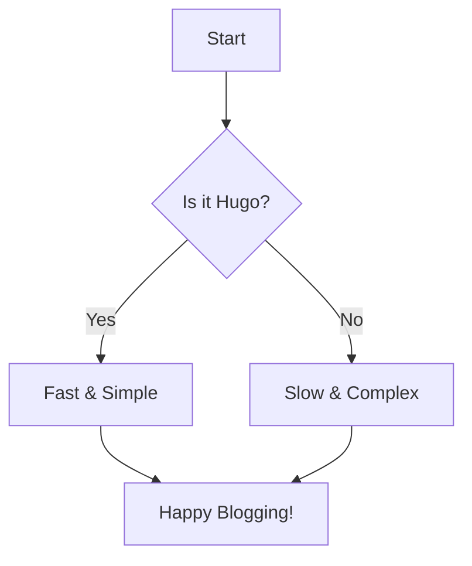

Welcome to my new blog! This blog is built with **Hugo** and the **PaperMod** theme.

## Code Highlighting Test

Here is a simple Python snippet:

```python
def hello_world():
    print("Hello, Hugo!")

if __name__ == "__main__":
    hello_world()
```

## Mermaid Diagram Test

We can also render diagrams directly in Markdown:



Enjoy!
